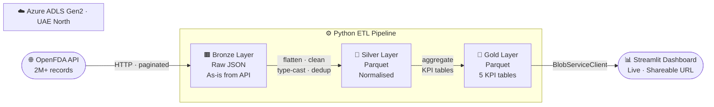

# 💊 Regulytics — FDA Drug Safety Intelligence Pipeline

> **End-to-end data engineering portfolio project** · Azure ADLS Gen2 · Medallion Architecture · Python · Streamlit

[](https://python.org)
[](https://azure.microsoft.com)
[](https://regulytics-demo.streamlit.app)
[](LICENSE)

A production-grade data pipeline that ingests **2M+ FDA drug adverse event records** from the OpenFDA REST API, processes them through a **Bronze → Silver → Gold medallion architecture** on Azure Data Lake Storage Gen2, and serves live KPIs through an interactive Streamlit dashboard.

**🔗 [View Live Dashboard →](https://regulytics-demo.streamlit.app)** &nbsp;·&nbsp; ✅ Live as of 2026-05-25

---

## 📐 Architecture



---

## 🗂️ Medallion Layers

The medallion architecture is a data design pattern that progressively refines raw data into analytics-ready tables. Each layer has a clear contract:

### 🟫 Bronze — Raw Ingestion
| Property | Detail |
|---|---|
| **Source** | OpenFDA Drug Adverse Events API (`/drug/event.json`) |
| **Format** | Raw JSON, one file per paginated API response |
| **Path** | `bronze/openfda/events/{run_ts}/page_NNNN.json` |
| **Transform** | None — exact copy of API response |
| **Records per run** | 5,000 (5 × 1,000-record pages) |
| **Why** | Full audit trail; re-processable from source without re-calling the API |

```python
# Bronze stores raw API responses with zero transformation
{
  "meta": { "results": { "total": 2032857, ... } },
  "results": [
    { "safetyreportid": "...", "receivedate": "20240115",
      "patient": { "drug": [...], "reaction": [...] }, ... }
  ]
}
```

### 🥈 Silver — Clean & Normalise
| Property | Detail |
|---|---|
| **Input** | All bronze JSON pages for a given run |
| **Format** | Apache Parquet (columnar, compressed) |
| **Path** | `silver/openfda/events/{run_ts}/silver_events.parquet` |
| **Key transforms** | See below |

**Transformations applied:**

| Field | Raw (Bronze) | Clean (Silver) |
|---|---|---|
| `receive_date` | `"20240115"` (string) | `2024-01-15` (datetime) |
| `serious` | `"1"` / `"2"` (string) | `True` / `False` (bool) |
| `patient_sex` | `"0"` / `"1"` / `"2"` | `"Unknown"` / `"Male"` / `"Female"` |
| `patient_age` | `"45"` (string) | `45.0` (float) |
| `age_group` | *(derived)* | `"35-49"` (bucketed label) |
| `drug_names` | `[{medicinalproduct: ...}, ...]` (nested array) | `"ASPIRIN, IBUPROFEN"` (flat string) |
| `reaction_terms` | `[{reactionmeddrapt: ...}, ...]` | `"NAUSEA, HEADACHE"` |
| Duplicates | Present | Removed on `safetyreportid` |
| Nulls | Mixed | Standardised per field |

### 🥇 Gold — KPI Aggregations
Five purpose-built analytical tables written to the Gold container, each updated on every pipeline run:

| Table | Rows | Use |
|---|---|---|
| `kpi_monthly_trend` | ~360 | Time series — total + serious events by year-month |
| `kpi_top_drugs` | 20 | Bar chart — top drugs by adverse event report count |
| `kpi_outcomes` | 4 | Pie chart — Serious / Non-serious / Death / Hospitalisation |
| `kpi_age_distribution` | 7 | Bar chart — events by age group (0–17 … 80+) |
| `kpi_sex_distribution` | 3 | Pie chart — events by reported sex |

Gold tables are written with `overwrite=True` so the dashboard always reads the latest snapshot — no downstream query changes needed when the pipeline reruns.

---

## 📊 Dashboard KPIs

The Streamlit dashboard connects directly to the Gold layer in Azure Blob Storage and renders five interactive Plotly visualisations:

| # | Chart | Insight |
|---|---|---|
| 1 | Monthly trend (line) | How adverse event reporting volume changes over time |
| 2 | Outcome breakdown (donut) | Proportion of serious vs. non-serious events |
| 3 | Top 20 drugs (bar) | Which drugs generate the most adverse event reports |
| 4 | Age group distribution (bar) | Which patient demographics are most represented |
| 5 | Sex distribution (donut) | Reporting split by patient sex |

A metric strip at the top shows headline numbers: total events, serious count, serious %, and deaths.

---

## 🛠️ Tech Stack

| Layer | Technology | Why |
|---|---|---|
| **Data source** | [OpenFDA API](https://open.fda.gov/apis/) | Free, no auth for small pulls, 2M+ real records |
| **Storage** | Azure ADLS Gen2 (UAE North) | Hierarchical namespace = native folder semantics; enterprise standard |
| **Ingestion** | Python · `requests` | Paginated API fetch, raw JSON land |
| **Transform** | Python · `pandas` · `pyarrow` | Vectorised transforms; Parquet for columnar efficiency |
| **Serialisation** | Apache Parquet | 10× smaller than CSV; schema-enforced; fast to query |
| **Dashboard** | Streamlit · Plotly | Rapid BI prototyping; shareable URL; Python-native |
| **Cloud secrets** | Streamlit Cloud secrets / `.env` | Zero credentials in code or git history |

---

## 📁 Project Structure

```
regulytics-demo/
│
├── run_pipeline.py          # 🚀 One command: Bronze → Silver → Gold
│
├── src/
│   ├── config.py            # Azure connection, API config (reads from .env)
│   ├── bronze/
│   │   └── openfda_ingest.py   # Paginated API fetch → Azure Blob JSON
│   ├── silver/
│   │   └── transform.py        # Flatten · clean · type-cast · dedup → Parquet
│   └── gold/
│       └── aggregate.py        # 5 KPI aggregations → Gold Parquet tables
│
├── dashboard/
│   └── app.py               # Streamlit app — reads Gold, renders Plotly charts
│
├── requirements.txt         # Full pipeline dependencies
├── runtime.txt              # Python 3.12 (pre-built wheels for all packages)
├── .env.example             # Environment variable template (never commit .env)
└── .gitignore               # Excludes .env, __pycache__, venv
```

---

## 🚀 Run It Yourself

### Prerequisites
- Python 3.12+
- Azure Storage account with ADLS Gen2 (hierarchical namespace enabled)
- Free [OpenFDA API key](https://open.fda.gov/apis/authentication/)

### Setup

```bash
# 1. Clone
git clone https://github.com/jayharish/regulytics-demo.git
cd regulytics-demo

# 2. Install dependencies
pip install -r requirements.txt

# 3. Configure credentials
cp .env.example .env
# Edit .env — add your Azure connection string and OpenFDA API key
```

**.env file:**
```
AZURE_STORAGE_CONNECTION_STRING=DefaultEndpointsProtocol=https;AccountName=...
AZURE_STORAGE_ACCOUNT_NAME=your_storage_account
OPENFDA_API_KEY=your_api_key
```

### Create Azure containers
In your Azure Storage account, create three containers:
```
bronze    silver    gold
```

### Run the pipeline

```bash
python run_pipeline.py
```

Expected output:
```
============================================================
REGULYTICS — OpenFDA Medallion Pipeline
============================================================

[1/3] BRONZE — ingesting from OpenFDA API...
  ✅ Uploaded 1000 records → bronze/openfda/events/20260525_003521/page_0000.json
  ✅ Uploaded 1000 records → bronze/openfda/events/20260525_003521/page_0001.json
  ... (5 pages)

[2/3] SILVER — transforming run 20260525_003521...
  ✅ Silver written → silver_events.parquet  (4,987 rows after dedup)

[3/3] GOLD — aggregating KPIs...
  ✅ gold/openfda/kpi_monthly_trend/latest.parquet
  ✅ gold/openfda/kpi_top_drugs/latest.parquet
  ✅ gold/openfda/kpi_outcomes/latest.parquet
  ✅ gold/openfda/kpi_age_distribution/latest.parquet
  ✅ gold/openfda/kpi_sex_distribution/latest.parquet

✅ Pipeline complete. Run timestamp: 20260525_003521
```

### Launch dashboard locally

```bash
streamlit run dashboard/app.py
# Opens at http://localhost:8501
```

---

## 🔑 Key Engineering Decisions

**Why ADLS Gen2 over plain Blob Storage?**  
Hierarchical namespace gives true folder semantics (atomic renames, directory-level ACLs), which is required for production data lakehouse patterns. Cost is identical to Blob Storage.

**Why Parquet for Silver and Gold?**  
Parquet is columnar and compressed. A 5,000-row Silver table is ~120 KB as Parquet vs ~900 KB as CSV. At scale (millions of records), this difference is the entire cost of a pipeline.

**Why overwrite Gold instead of append?**  
Gold tables are KPI snapshots. Appending would require the dashboard to filter by run_ts on every read. Overwriting means the dashboard is always one `read_parquet` call — no watermarks, no window logic, no state management.

**Why `run_ts` as a folder partition in Bronze/Silver?**  
Every pipeline run is reproducible and auditable. If Silver has a bug, you reprocess from Bronze without re-calling the API. The timestamp partition makes it trivial to inspect or delete any run.

---

## 🗺️ Roadmap

- [ ] **Scheduling** — Azure Function timer trigger for daily automated runs
- [ ] **Incremental load** — watermark on `receivedate` so each run only fetches new records
- [ ] **Data quality checks** — Great Expectations or custom validators between Bronze → Silver
- [ ] **AI layer** — Azure OpenAI natural language Q&A on the Gold tables
- [ ] **Alerts** — email/Teams notification when serious event rate spikes week-on-week
- [ ] **Second dataset** — UAE Ministry of Health open data (PROJ-002)

---

## 👤 Author

**Jay Jethva** · [github.com/jayharish](https://github.com/jayharish) · [jayh.jethva@gmail.com](mailto:jayh.jethva@gmail.com)

Built as part of the **Regulytics** Microsoft-enterprise services practice — a pipeline factory for delivering Azure data engineering solutions to UAE enterprises.

---

*Data source: [OpenFDA](https://open.fda.gov) — U.S. Food & Drug Administration. Open data, updated weekly.*  
*Infrastructure: Microsoft Azure — UAE North region.*
